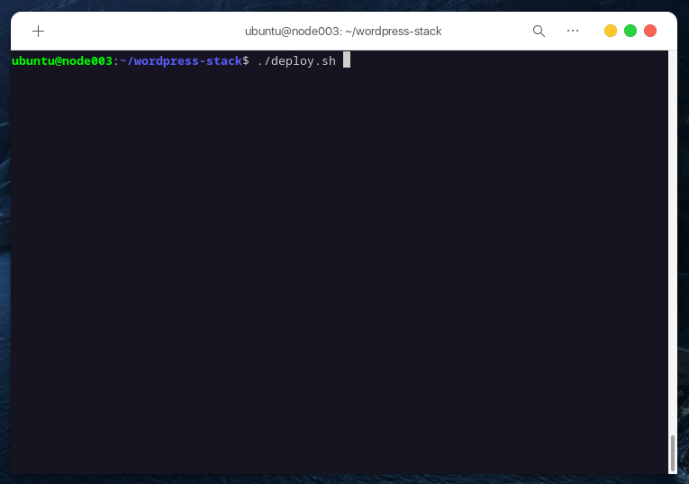

# WordPress-Stack On Kubernetes

[](https://github.com/mi-alkhamis/wordpress-stack/blob/main/LICENSE)
[](https://github.com/mi-alkhamis/wordpress-stack/stargazers)

 


Stargaze  if you find it useful.

Script and manifests to deploy WordPress stack on Kubernetes.

### This stack contains:

 - **WordPress**
 - **File Browser**
 - **Poste.io**
 - **phpMyAdmin**
 - **MySQL**


## How to deploy the stack:

The stack is tested on Kubernetes 1.21.5, should work on earlier versions.

### Prerequisites:

  1. Kubernetes 1.21+ must be installed.
  2. Kubernetes should support LoadBalancer type
  3. OpenSSL to create self-signed certificates.


### Get started:

```sh
./deploy
```




## How to contribute:

Don't hesitate! all contributions are welcomed.

### TODO:

  - [x] SSL/TLS for Poste.io
  - [ ] Update tools to the latest stable version
  - [ ] SSL/TLS for File Browser
  - [ ] SSL/TLS for phpMyAdmin\
  - [ ] SSL/TLS for WordPress
  - [ ] Create Custom configuration for File Browser

[@dwsclass](https://github.com/dwsclass) dws-ops-011-kubernetes
